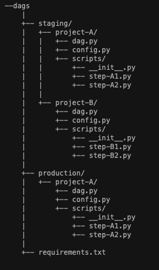

##  This README is a WIP

## MWAA (Managed Worflows Apache Airflow)

### What is Apache Airflow

Airflow is a platform to programmatically author, schedule and monitor workflows.

Use Airflow to author workflows as Directed Acyclic Graphs (DAGs) of tasks. The Airflow scheduler executes your tasks on an array of workers while following the specified dependencies. Rich command line utilities make performing complex surgeries on DAGs a snap. The rich user interface makes it easy to visualize pipelines running in production, monitor progress, and troubleshoot issues when needed.

When workflows are defined as code, they become more maintainable, versionable, testable, and collaborative. 
[Apache Airflow documentation](https://airflow.apache.org/docs/apache-airflow/stable/index.html)

### What is MWAA

Amazon Managed Workflows for Apache Airflow (MWAA) is a managed orchestration service for Apache Airflow that makes it easier to setup and operate end-to-end data pipelines in the cloud at scale. Apache Airflow is an open-source tool used to programmatically author, schedule, and monitor sequences of processes and tasks referred to as "workflows." With Amazon MWAA, you can use Airflow and Python to create workflows without having to manage the underlying infrastructure for scalability, availability, and security. Amazon MWAA automatically scales its workflow execution capacity to meet your needs, and is integrated with AWS security services to help provide you with fast and secure access to your data. [MWAA documentation](https://docs.aws.amazon.com/mwaa/latest/userguide/what-is-mwaa.html)

### Pricing
For Airflow environments, we get a flat rate per environment. That price is charged even if we don’t have any DAGs running. The price depends on the size of the environment (based on AWS documentation, a small one should be enough to support up to 50 DAGs). A small environment cost approx. 364 USD per month (see below). Apart from that, we pay for the workers and the schedulers (they are fairly cheap, see tables pricing in the link below).

**Pricing conclusion**:
We should try to have as few environments as possible and use only a small size for now. We can consider moving to a medium-size environment when we reach more than 50 DAGs.

Text is taken from https://aws.amazon.com/managed-workflows-for-apache-airflow/pricing/

Environment Pricing (Hourly Instance Usage)
You pay for your Managed Workflows environment usage on an hourly basis (billed at one second resolution), with varying fees depending on the size of the environment. See the Environment Instance Pricing table for details.

*Additional Worker Instance Pricing* (Hourly Instance Usage)
If you opt for auto-scaling, you pay for any additional worker instances used based upon your Managed Workflow environment task load. Usage is billed on an hourly basis (at one second resolution), with varying fees depending on the size of the environment. See the Additional Worker Instance Pricing table for details.

*Additional Scheduler Instance Pricing* (Hourly Instance Usage)
If you opt for additional schedulers beyond those included with your Managed Workflows environment, you pay for any additional scheduler instances used based upon your Managed Workflow environment availability. See the Additional Scheduler Instance Pricing table for details.

*Database Storage* (GB-month Storage)
Storage consumed by your Managed Workflows metadatabase is billed in per GB-month increments. You pay only for the storage your Managed Workflows meta database consumes and does not need to provision in advance.

**Pricing example**:

If you are operating a small Managed Workflows environment with Apache Airflow version 1.10.12 in the US East (N. Virginia) region where each day your system spikes to 50 concurrent workers for an hour, with typical data retention, you would pay the following for the month:

Environment charge
Instance usage (in hours) = 31 days x 24 hrs/day = 744 hours
x $0.49 (price per hour for a small environment in the US East (N. Virginia) region)
= $364.56

Worker charge
Instance usage (in hours) = 31 days x 1 hrs/day x 49 additional instances (50 less 1 included with environment) = 1519 hours
x $0.055 (price per hour for a small worker in the US East (N. Virginia) region)
= $83.55

Meta database charge
10 GB or storage x $0.10 GB-month = $1.00
Total charge = $449.11

### Dixa labs
**We have a MWAA environment in Dixa Labs account (544286230891)**
- **Airflow version**: 1.10.12
- **name**: mwaa-environment-public-network-MwaaEnvironment [here](https://eu-west-1.console.aws.amazon.com/mwaa/home?region=eu-west-1#environments/mwaa-environment-public-network-MwaaEnvironment)
- **bucket**: mwaa-environment-public-network-environmentbucket-pwewkbc08bys [here](https://eu-west-1.console.aws.amazon.com/s3/buckets/mwaa-environment-public-network-environmentbucket-pwewkbc08bys?region=eu-west-1&tab=objects)
- **requirements**: bucket/dags/requirements.txt
- **role**: mwaa-environment-public-network-MwaaExecutionRole-17LYEO92FDZVE [here](https://console.aws.amazon.com/iam/home?#/roles/mwaa-environment-public-network-MwaaExecutionRole-17LYEO92FDZVE)
- **Temporal files bucket**: airflow-temporal-objects [here](https://s3.console.aws.amazon.com/s3/buckets/airflow-temporal-objects?region=eu-west-1&tab=objects)
- **Repository**: temporal repo [here](https://github.com/alexflorezr/data-orchestrator)
- **Repo structure**:
 

 
- **dags**
    - name: feature_store_pipeline
    - dag graph view: feature_store_pipeline
 

 

### Current airflow architecture main AWS account (038101219289)
**Building the airflow environment in AWS (iac)**

MWAA environments will be created on the main AWS as iac using Pulumi. As of today (04.09.2021) we have a branch (https://github.com/dixahq/iac/tree/mwaa_ai_team) in the iac repository. We are currently working on merging our branch to create a MWAA environment in the stag (one of the staging environments) in the AWS main account.

Each MWAA has its own definitions of VPC and subnets. Depending on the resources or data needed for the pipeline, we might have to create different environments. For now, that is not an issue and we can consider having 1 airflow environment with 2 copies of dags - e.g dag_1_staging and dag_1_prod where each dag is connected to staging and prod s3buckets respectively.

- Service role and policies
####  more documentation will be added in the future
- Dags bucket structure ( suggested folder structure)  

 

#### Developing pipelines in MWAA
- Setting-up airflow versions
- Running MWAA locally
- Github repo data-orchestrator  [here](https://github.com/dixahq/data-orchestrator)
- Github actions
In your repo root folder:
1. Create a .github folder
2. Create a .github/workflows folder
3. Create a yml file (basically the config for your actions)

#### Things to know
- Operators
- Scheduler